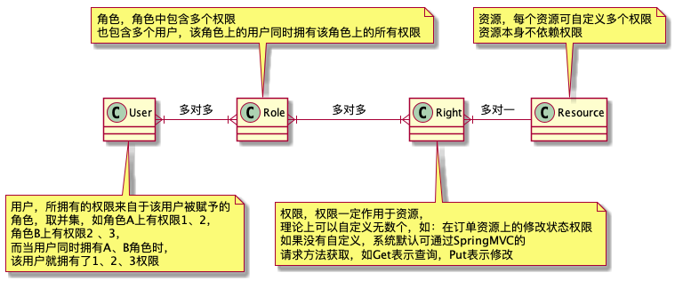

 # Guard权限管理框架

[](https://app.codacy.com/manual/vipweihua/guard?utm_source=github.com&utm_medium=referral&utm_content=vipweihua/guard&utm_campaign=Badge_Grade_Dashboard)

 ## 初衷与目的
 Guard可以通过注解实现用户对接口数据的过滤及访问控制。
 开发阶段，只需要定义资源（Resource）及访问接口需要的权限（Right）；
 用户、角色、权限三者的关系可以根据配置控制，这种配置是事后的，可以json、配置中心、管理平台完成。
 
 ## 原理介绍
 


 ### @GuardResource注解
 GuardResource注解定义资源，它的含义与Restful提倡的资源同义，一般置于Controller类上，以表示该类中定义的接口都需要在该资源上拥有权限，如下代码：
 ```java
 @GuardResource("order")
 @RestController
 @RequestMapping("order")
 public class OrderController{
 //省略方法
 }
 ```
 
 ### @RightType, @Create, @Retrieve, @Update, @Delete, @GetMapping, @PostMapping, @PutMapping, @DeleteMapping
 严格模式下（通过guard.strict.mode=true设定），自动识别SpringMVC定义的@GetMapping, @PostMapping, @PutMapping, @DeleteMapping，
 即，不需要任何额外注解，使用@GetMapping注解即表示该接口为获取数据接口，所需权限类型就是Retrieve，只要用户拥有当前资源下的Retrieve权限即可访问，
 @PostMapping, @PutMapping, @DeleteMapping三个注解以此类推。如：
 ```java
 @GetMapping("order/id/{id}")
 public Response<List<String>> findById(@PathVariable String id){
   return Response.success(UserThreadLocal.getLimitation());
 }
 ```
 上面方法的定义做到了无任何侵入性，没有任何额外代码，接口规范的情况下，当然首选以上方式。
 
 但非严格模式下（通过guard.strict.mode=false设定，或默认不配置），采用PostMapping定义的接口也可能是获取数据，此时需要开发者自己显式声明，如：
 ```java
 @Retrieve
 @PostMapping("order/search")
 public Response<List<String>> searchOrder(@RequestBody SearchBean searchBean){
   return Response.success(UserThreadLocal.getLimitation());
 }
 ```
 
 同时也支持自定义权限类型，可以@RightType指定，如下自定义deliver权限，同时在权限列表中分配相关角色即可：
 ```java
 @RightType(type = "deliver")
 @PutMapping("id/{id}")
 public Response<List<String>> deliver(@PathVariable String id){
   return Response.success(UserThreadLocal.getLimitation());
 }
 ```
 
 ## Demo使用说明
 直接运行位于guard-demo模块下的Application主函数即可，无需任何配置，测试时
 访问地址：
  * GET [http://localhost:8080/order/id/123](http://localhost:8080/order/id/123) 测试无注解权限控制

  * PUT [http://localhost:8080/order/id/123](http://localhost:8080/order/id/123) 测试自定义注解权限控制
 header中请添加key=user，value可取值：zhangsan/lisi/wangsu/zhaoliu/weihua,分别对应的权限见resource文件夹中的几个json设置，也可更改后查看变化
 
 更多的测试大家可以自行研究下几个json，也可以写更多的Controller来测试。
 
 ### Demo说明
 虽然这只是一个Demo，但我希望每一份代码有价值，因此以非常规范的方式开发，简单模拟保险业务。
 
 #### 模型
 * 基类BaseEntity，所有模型的父类，这是我的惯例，可以将通用的字段下沉到该类，好处是显而易见的。
 
   * 子类无须重复定义，简单明了却又指责明确，
   * 可以通过使用instanceof来判断是否本项目模型，会很受用
   * Mapper和Service的基类可以对BaseEntity中定义的属性做些通用的设置，如创建时设置id、createdAt等，修改时设置lastModifiedAt、version等
   * 通过范型，将通用方法直接下沉到BaseMapper和BaseService，该范型可以定义为T extends BaseEntity
   * 好处多多，不胜枚举，强烈建议创建模型基类
 
 * Order类模拟保险业务订单，当前属性不多，用到几个加几个
 * Policy类模拟保险业务保单，订单与保单的关系为一对多关系
 
 #### Mapper
 目前没有BaseMapper，不是不需要，而是实现有一定困难，因为在BaseMapper中实现一个findById的通用方法，表名是动态的，而这动态表名的比较困难，当前不是主要问题，可以延后实现。
 
 - OrderMapper是订单的Mapper类，实现的不是很通用，将来重构
 - PolicyMapper是保单的Mapper类
 
 #### Service
 延后实现
 
 #### Controller
 * BaseController实现大部分通用逻辑，时间长了，就会越来越发现BaseController的作用，初期可以置为空
 * OrderController实现订单特有的功能
 
 ## RoadMap
 
  * 用户体验：对于一个及其规范的项目，所有的Controller可能都会有明确的继承关系和范型设定，如OrderController -> BaseController，
 在OrderController类头定义部分我们发现，不仅@Resource指定，同时@RequestMapping和范型也指定了Order，这些都是重复信息，
 如果能够在使用Guard的情况下默认使用一个，同时亦可覆盖则会更佳。
 
  * 扩展性：这应该是将来的大头，当前只实现了以json方式的数据源，将来会有更多的数据源，如配置中心、或者hibernate/Mybatis等ORM，通过拦截器方式直接无缝过滤数据，也欢迎各位大侠路过指点。

  * 代码纯洁性：模块的划分是否合理，当前guard-core直接依赖了spring-boot-starter-web，有点过重，完美的情况下希望足够轻量，其余都只是扩展。

 ## 最后，欢迎各位能加入一起开发